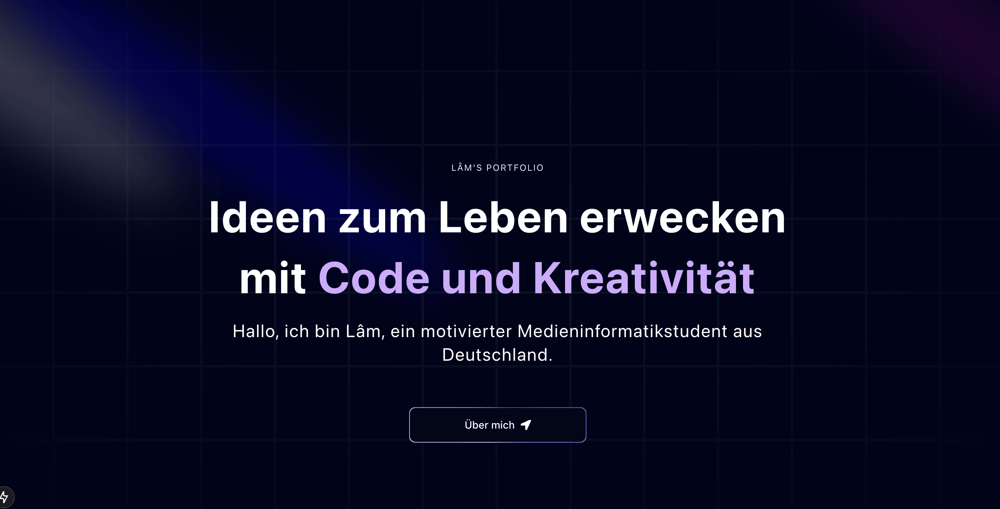

Readme

# Portfolio - Duc Lam Nguyen 🚀

Ein modernes Portfolio, entwickelt mit Next.js und TailwindCSS, das meine Projekte und Fähigkeiten als Medieninformatik-Student präsentiert.



## 🛠 Tech Stack

- **Framework:** Next.js 14
- **Styling:** Tailwind CSS
- **Animationen:** Framer Motion
- **Icons:** React Icons
- **TypeScript** für type-safety

## ✨ Features

- Responsive Design für alle Geräte
- moderne UI-Komponenten
- Interaktive Projektdarstellung
- Smooth Scroll Animations


## 🚀 Installation

1. Repository klonen
```bash
git clone https://github.com/yourusername/portfolio.git 
```

2. Dependencies installieren
```bash
cd portfolio
npm install
```
3. Development Server starten

```bash
npm run dev
```

## 📁 Projekt-Struktur
```
portfolio/
├── app/
│   ├── globals.css
│   ├── layout.tsx
│   ├── page.tsx 
│   └── provider.tsx
├── components/
│   ├── Experience.tsx
│   ├── Footer.tsx
│   ├── Grid.tsx
│   ├── Hero.tsx
│   ├── RecentProjects.tsx
│   └── ui/
│       ├── 3d-pin.tsx
│       ├── BentoGrid.tsx
│       ├── FloatingNav.tsx  
│       ├── MagicButton.tsx
│       ├── MovingBorders.tsx
│       ├── Spotlight.tsx
│       └── text-generate-effect.tsx
├── data/
│   ├── index.ts           # Zentrale Datenverwaltung
│   └── confetti.json
├── lib/
│   └── utils.ts
├── public/ 
│   │── arrow.svg
│   │── app.svg
│   │── appName.svg
│   ├── bg.png
│   └── preview.png
├── styles/
│   └── globals.css
├── .eslintrc.json
├── .gitignore
├── next.config.ts
├── package.json
├── postcss.config.js
├── README.md
├── tailwind.config.ts
└── tsconfig.json
```
## 🔗 Kontakt
- GitHub: @NotAisu 
- E-Mail: dlam.nguyen03@gmail.com

